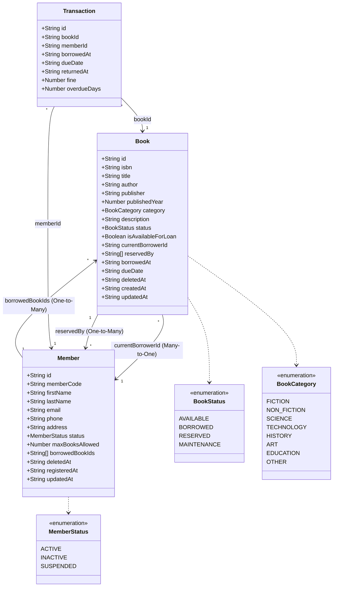

```mermaid
classDiagram
class Book {
+String id
+String isbn
+String title
+String author
+String publisher
+Number publishedYear
+BookCategory category
+String description
+BookStatus status
+Boolean isAvailableForLoan
+String currentBorrowerId
+String[] reservedBy
+String borrowedAt
+String dueDate
+String deletedAt
+String createdAt
+String updatedAt
}

    class Member {
        +String id
        +String memberCode
        +String firstName
        +String lastName
        +String email
        +String phone
        +String address
        +MemberStatus status
        +Number maxBooksAllowed
        +String[] borrowedBookIds
        +String deletedAt
        +String registeredAt
        +String updatedAt
    }

    class Transaction {
        +String id
        +String bookId
        +String memberId
        +String borrowedAt
        +String dueDate
        +String returnedAt
        +Number fine
        +Number overdueDays
    }

    class BookStatus {
        <<enumeration>>
        AVAILABLE
        BORROWED
        RESERVED
        MAINTENANCE
    }

    class BookCategory {
        <<enumeration>>
        FICTION
        NON_FICTION
        SCIENCE
        TECHNOLOGY
        HISTORY
        ART
        EDUCATION
        OTHER
    }

    class MemberStatus {
        <<enumeration>>
        ACTIVE
        INACTIVE
        SUSPENDED
    }

    Book "*" --> "1" Member : currentBorrowerId (Many-to-One)
    Book "1" --> "*" Member : reservedBy (One-to-Many)
    Member "1" --> "*" Book : borrowedBookIds (One-to-Many)

    Transaction "*" --> "1" Book : bookId
    Transaction "*" --> "1" Member : memberId

    Book ..> BookStatus
    Book ..> BookCategory
    Member ..> MemberStatus
```
